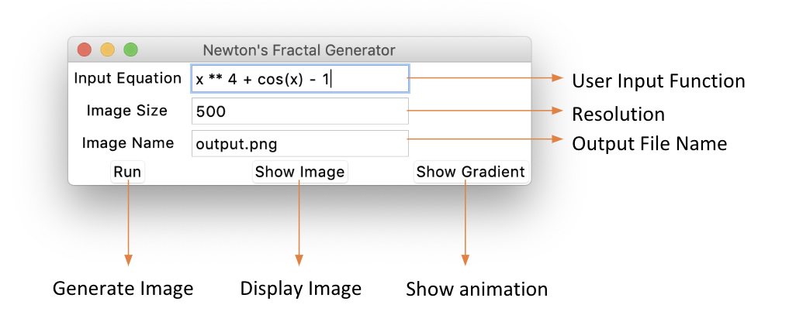

## Installation Guide

This is documentation contains some installation guidance in running our feature - Newton's Fractal.

Assuming that you have a new environment in Python 3 created by:

- ```py
  conda create --name my_env python=3.6
  ```

Some additional packages need to be installed. Please run following commands to install necessary packages:

* ```py
  pip install Pillow
  pip install tqdm
  pip install matplotlib
  ```

If you want, you can also use the following script to automatically download all the necessary packages for you.

- ```py
  pip install -r requirements.txt
  ```

After installing these packages, the feature should be up and running. We have also included a demonstration written in Jupyter notebook to show you how to play around with our package. This documentation can be found at: docs/Final/demo_Feature.ipynb.

Reference: 

Stack Overflow: https://stackoverflow.com/questions/21784641/installation-issue-with-matplotlib-python

## Fractals!


We provide a Graphical User Interface for our feature.


When we enter the function f(x)=x<sup>6</sup>-1, we will get the picture below:


When we click the `show gradient` button, we will get the animation of the root finding process. 

